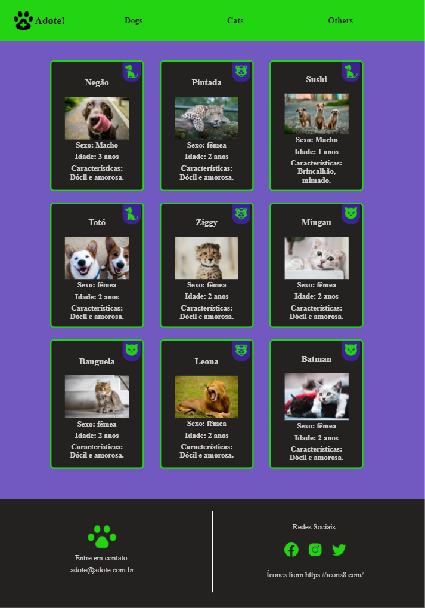

<h1 align="center">Página responsiva</h1>

---

## Índice

- [Sobre](#-sobre)
- [Tecnologias Utilizadas](#-tecnologias-utilizadas)
- [Resultado](#-resultado)
- [Referências](#-referencias)

---

### Sobre

Criação de uma página responsiva, usando Media queries e display flex. Foi criada uma página de adoção de pets.

---

### Tecnologias Utilizadas

- HTML
- CSS
  - Media Query
  - Display Flex

---

### Resultado

No desktop:

Em dispositivos mobile:

---

### Referências:

- [Ícones - Icon8](https://icons8.com/)
- <a target="_blank" href="https://icons8.com/icons/set/veterinarian">Veterinarian icon</a> icon by <a target="_blank" href="https://icons8.com">Icons8</a>
- <a target="_blank" href="https://icons8.com/icons/set/cat-head">Cat Head icon</a> icon by <a target="_blank" href="https://icons8.com">Icons8</a>
- <a target="_blank" href="https://icons8.com/icons/set/dog-sit--v2">Dog Sit icon</a> icon by <a target="_blank" href="https://icons8.com">Icons8</a>
- <a target="_blank" href="https://icons8.com/icons/set/year-of-tiger">Year of Tiger icon</a> icon by <a target="_blank" href="https://icons8.com">Icons8</a>
- <a target="_blank" href="https://icons8.com/icons/set/dog-footprint">Dog Paw icon</a> icon by <a target="_blank" href="https://icons8.com">Icons8</a>
- [Unsplash](https://unsplash.com/)
